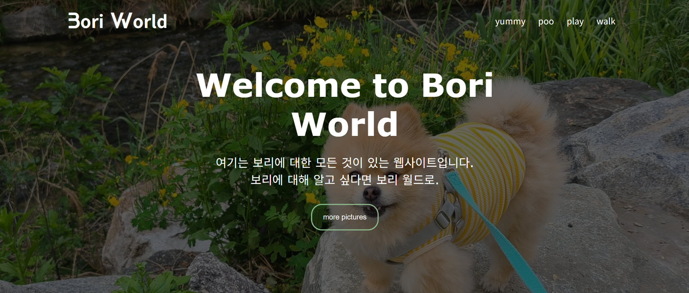

# Bori World 🐶

반려견 **보리**를 소개하는 1페이지 웹사이트입니다.  
HTML/CSS로 제작하고 **GitHub Pages**로 배포했습니다.

- ▶️ 배포 링크: https://syeonhh11.github.io/bori-world/
- 💻 저장소: https://github.com/syeonhh11/bori-world

---

## 📸 스크린샷
> 

---

## ✨ 주요 기능
- 히어로 섹션(중앙 정렬된 타이틀/설명/버튼)
- 배경 이미지 + 어두운 오버레이
- 커스텀 웹폰트 적용 (`abster`)
- 간단한 네비게이션 메뉴와 hover 효과

---

## 🧱 기술 스택
- **HTML5**, **CSS3**
- 폰트: `abster-webfont.woff`
- 배포: **GitHub Pages**

---

## 🗂 폴더 구조
bori-world/
├─ index.html
├─ style.css
├─ images/
│ └─ bori.jpg
└─ font/
└─ abster-webfont.woff

